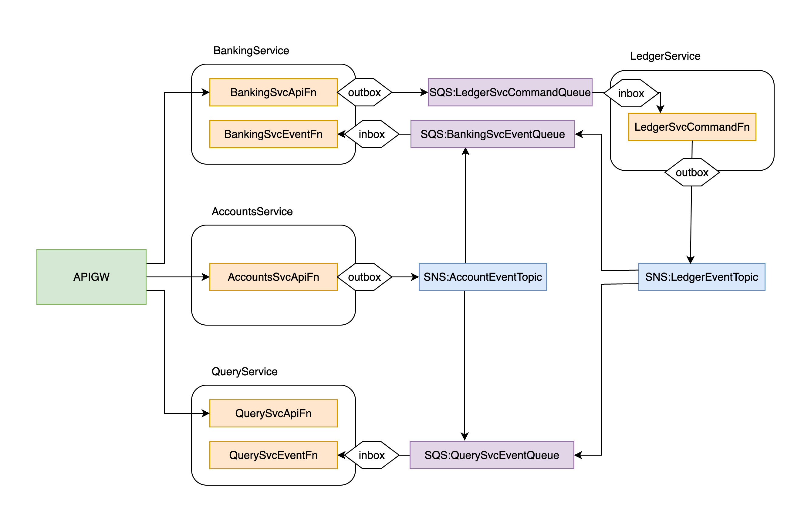

# Digital Banking Platform

A simple digital banking platform with event-driven microservices architecture built using Node.js, TypeScript, and AWS services with SAM CLI.

## Project Structure

```
digital-banking/
├── services/
│   ├── banking/        # Banking service for user operations
│   ├── ledger/         # Ledger service for transactions
│   ├── accounts/       # Account management service
│   ├── query/          # Query service for reading data
│   └── notifications/  # Notifications service (not implemented)
├── shared/
│   ├── models/         # Shared data models
│   ├── utils/          # Shared utilities
│   ├── events/         # Event definitions
│   └── constants/      # Shared constants
├── template.yaml       # SAM template
├── tsconfig.base.json  # Base TypeScript configuration
└── turbo.json          # Turborepo configuration
```

It's a monorepo project managed by turborepo.
Since it's a monorepo, SAM templates will be placed in the root folder as central template for ease of use.

## Prerequisites

- Node.js 18+
- AWS SAM CLI
- AWS CLI configured with appropriate credentials

## Setup

1. Install dependencies:

```bash
npm install
```

2. Build all services:

```bash
npm run build
```

## Local Development

```bash
npm run dev
```

This will start the TypeScript compiler in watch mode for all services.

To start the API locally:

```bash
sam local start-api
```

## Deployment

```bash
npm run deploy
```

## Authentication

```bash
aws cognito-idp initiate-auth \
  --client-id 3qacpltbnk17amkk52urt40r3 \
  --auth-flow USER_PASSWORD_AUTH \
  --auth-parameters USERNAME=test@mail.com,PASSWORD=Aa123456
```

## Architecture

This project follows an event-driven microservices architecture with the following components:

- **Banking Service**: Handles user operations (deposit, withdraw)
- **Ledger Service**: Single source of truth for transactions
- **Accounts Service**: Manages account information
- **Query Service**: For reading/querying balances and transaction histories
- **Notifications Service**: For sending notifications (not implemented)



### Architectural Concepts 

- Event-driven architecture
- Microservices architecture
- Outbox pattern: Handled by DynamoDB Streams
- Inbox pattern: Handled by Powertools's IdempotentHandler
- CQRS: Commands and Queries are separated
- Event Sourcing: Append-only transactions

N-Tier Architecture vs. Onion Architecture:
- For the sake of simplicity and for avoiding boilerplate, N-Tier Architecture is used for this assignment.
- But it can be transformed to Onion Architecture with some refactoring later, if needed with incoming complexity.
- Handlers are provided inline in entry points(lambdas) as they're simple and straightforward. They can be extracted to separate files if needed.

## Technologies Used

- TypeScript
- Node.js
- AWS Lambda
- AWS API Gateway
- AWS DynamoDB
- AWS SQS
- AWS Cognito
- AWS SAM
- Turborepo
- AWS Lambda Powertools
- InversifyJS (for DI in Banking Service)
- Jest (for testing)
